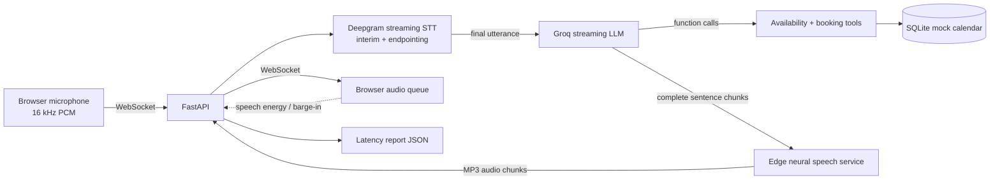

# Talk2Book

Real-time browser voice receptionist for checking Northside Turf availability and reserving one-hour field slots. Audio is streamed to Deepgram, responses stream from Groq, and Microsoft Edge neural voices generate speech through the `edge-tts` community client. The SQLite turf calendar rejects conflicting reservations atomically.

## Architecture



The first LLM response streams text and accumulates any function calls; tool results are then passed back to Groq for a spoken answer. Completed sentence chunks are synthesized and sent while later response tokens are still generating. The browser schedules audio chunks in order. Speech energy during playback stops queued audio and cancels the in-flight response.

## Run locally

Requirements: Python 3.12, a working microphone, Groq and Deepgram API keys, and an internet connection. Edge TTS needs no speech API key or payment card; it uses Microsoft's online Edge speech service through an unofficial community client, so service availability and limits may change. The `edge-tts` package is GPL-3.0; check license compatibility before redistributing the project. `DEEPGRAM_ENDPOINTING_MS` controls how long silence is allowed before a turn is finalized (default 1200 ms; supported range 1000-5000 ms).

```powershell
py -3.12 -m venv .venv
.\.venv\Scripts\Activate.ps1
python -m pip install -r requirements.txt
Copy-Item .env.example .env
```

Add `GROQ_API_KEY` and `DEEPGRAM_API_KEY` to `.env`. The default speech voice is `en-US-AriaNeural`; set `EDGE_TTS_VOICE` and `EDGE_TTS_RATE` to choose another voice or speaking rate. Then start the app:

```powershell
uvicorn backend.main:app --reload --reload-dir backend --reload-dir frontend
```

Open <http://127.0.0.1:8000>. Microphone access requires localhost or HTTPS. Press the microphone button to start, ask for a turf slot, then either pause for the configured silence interval or press the mic button again to finish the phrase. When the transcript is marked ready, press Send. The assistant checks one-hour slots and can reserve an available start time. Keep headphones on or use echo cancellation to avoid speaker audio triggering barge-in.

Run the deterministic booking, streaming, and speech-text tests:

```powershell
python -m unittest discover -s tests -v
```

## Calendar behavior

Northside Turf offers one-hour bookings in two sessions: morning from 06:00 through 11:00, with starts at 06:00, 07:00, 08:00, 09:00, and 10:00; and evening from 19:00 through midnight, with starts at 19:00, 20:00, 21:00, 22:00, and 23:00. Weekday morning slots cost ₹1,500, weekday evening slots ₹2,500, and both weekend sessions ₹3,000. `check_availability` accepts `morning`, `evening`, or `any` and never returns prices. If a player asks to book, the assistant quotes the applicable charge and waits for explicit approval before reserving. After approval, it returns an order ID and a structured name/time/charges summary. Players must arrive at the physical counter 10 minutes early and pay there; unpaid slots may be assigned to another player. The mock does not process or track payments. The SQLite unique constraint on date/time prevents double booking even when two requests race. The local database defaults to `data/calendar.sqlite3`; set `CALENDAR_DB_PATH` to change it.

## Latency measurements

Each processed turn appends time-to-first-response-audio and stage timings to [`results/latency_report.json`](results/latency_report.json). It currently contains 12 historical turns across earlier TTS versions, not a turf-specific Edge TTS baseline. Preserve these entries and compare new turf turns separately. The p95 summary is the nearest-rank 95th percentile.

| Measurement | Current result |
| --- | --- |
| Completed voice turns | 12 historical, mixed TTS |
| Median time to first audio | 6.1 s (mixed historical data) |
| p95 time to first audio | 45.9 s (mixed historical data) |
| Largest latency contributor | Earlier Kokoro turns; measure turf/Edge separately |

## Deployment

`Dockerfile` and `render.yaml` are included for a WebSocket-capable Render web service. Create the service from this repository, set `GROQ_API_KEY` and `DEEPGRAM_API_KEY` in the host dashboard, then open the deployed HTTPS URL. Its client automatically uses `wss://`. Check the selected host's current free-tier and persistent-disk limits before relying on it for a public demo: free instances may sleep, and the mock calendar database is ephemeral unless a persistent disk is configured. A public deployment cannot be created from this workspace without hosting credentials.

## Known limitations

- English (`en-US`) transcription and the `en-US-AriaNeural` Edge voice are configured by default; accents and noisy rooms need testing.
- The browser uses client-side RMS energy for barge-in. Loud background sound or speaker echo can interrupt the agent; headphones and browser echo cancellation help.
- Edge TTS requires network access and relies on an unofficial client. Spoken text is normalized for common dates, times, and markup before synthesis.
- Turf sessions, prices, one-hour duration, locale, and timezone are fixed for this mock. Dates are interpreted using the server's current date; no real venue or payment system is connected.
- There are no real latency results or recorded demo clip checked in yet. Run at least 15 turns and capture a real interruption before using the resume claim in the project brief.