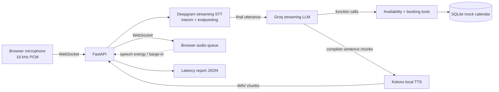

# Talk2Book

Real-time browser voice receptionist for checking appointment availability and booking a slot. Audio is streamed to Deepgram, responses stream from Groq, and Kokoro generates speech sentence-by-sentence. The mock calendar is SQLite-backed and rejects conflicting reservations atomically.

## Architecture



The first LLM response streams text and accumulates any function calls; tool results are then passed back to Groq for a spoken answer. Completed sentence chunks are synthesized and sent while later response tokens are still generating. The browser schedules audio chunks in order. Speech energy during playback stops queued audio and cancels the in-flight response.

## Run locally

Requirements: Python 3.12, a working microphone, and Groq and Deepgram API keys. Kokoro downloads model assets on first synthesis and runs locally on CPU; first-turn setup and synthesis can take longer than subsequent turns. `DEEPGRAM_ENDPOINTING_MS` controls how long silence is allowed before a turn is finalized (default 1200 ms; supported range 1000-5000 ms).

```powershell
py -3.12 -m venv .venv
.\.venv\Scripts\Activate.ps1
python -m pip install -r requirements.txt
Copy-Item .env.example .env
```

Add `GROQ_API_KEY` and `DEEPGRAM_API_KEY` to `.env`, then start the app:

```powershell
uvicorn backend.main:app --reload --reload-dir backend --reload-dir frontend
```

Open <http://127.0.0.1:8000>. Microphone access requires localhost or HTTPS. Press the microphone button to start, speak, then either pause for the configured silence interval or press the mic button again to finish the phrase. When the transcript is marked ready, press Send. The browser needs to allow microphone access. Keep headphones on or use echo cancellation to avoid the speaker audio triggering barge-in.

To run the offline calendar tests without installing model/provider packages:

```powershell
python -m unittest discover -s tests -v
```

## Calendar behavior

Slots are available every 30 minutes from 09:00 through 16:30. `check_availability` accepts `morning`, `afternoon`, `evening`, `any`, or an explicit `HH:MM-HH:MM` window. The SQLite unique constraint on date/time prevents double booking even when two requests race. The local database defaults to `data/calendar.sqlite3`; set `CALENDAR_DB_PATH` to change it.

## Latency measurements

Each processed turn appends time-to-first-response-audio and stage timings to [`results/latency_report.json`](results/latency_report.json). The repository starts with no measured turns: populate this report by running real conversations before claiming median or p95 performance. Measurements require working provider keys and a successful Kokoro model load. The p95 summary is the nearest-rank 95th percentile.

| Measurement | Current result |
| --- | --- |
| Completed voice turns | 0 (not yet measured) |
| Median time to first audio | Not measured |
| p95 time to first audio | Not measured |
| Largest latency contributor | Requires real measurements |

## Deployment

`Dockerfile` and `render.yaml` are included for a WebSocket-capable Render web service. Create the service from this repository, set `GROQ_API_KEY` and `DEEPGRAM_API_KEY` in the host dashboard, then open the deployed HTTPS URL. Its client automatically uses `wss://`. Check the selected host's current free-tier and persistent-disk limits before relying on it for a public demo: free instances may sleep, and the mock calendar database is ephemeral unless a persistent disk is configured. A public deployment cannot be created from this workspace without hosting credentials.

## Known limitations

- English (`en-US`) transcription and the `af_heart` Kokoro voice are configured by default; accents and noisy rooms need testing.
- The browser uses client-side RMS energy for barge-in. Loud background sound or speaker echo can interrupt the agent; headphones and browser echo cancellation help.
- Kokoro is self-hosted, but its first-run model download and CPU synthesis can dominate response latency. It is sentence-incremental rather than waveform-token streaming.
- Calendar hours, slot duration, locale, and timezone are fixed for this mock. Dates are interpreted using the server's current date; no real clinic or business system is connected.
- There are no real latency results or recorded demo clip checked in yet. Run at least 15 turns and capture a real interruption before using the resume claim in the project brief.